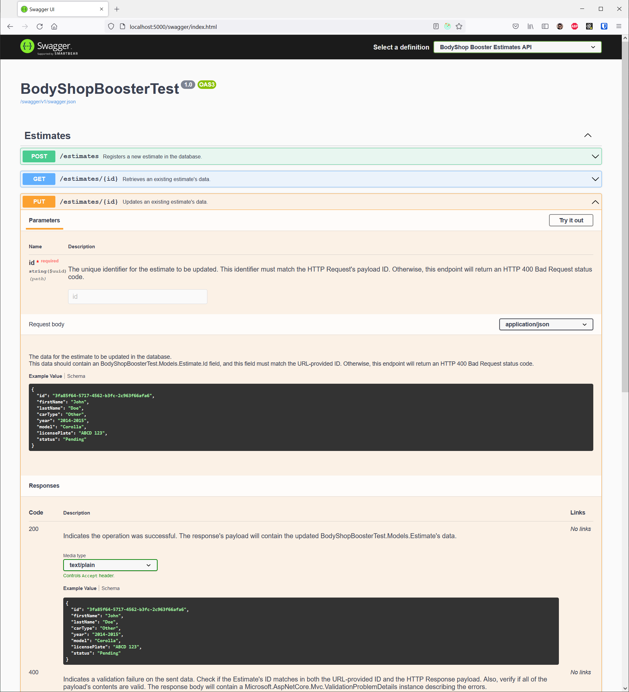

# BodyShop Booster - Test Project - Vinicius Silva
## Description
This repository contains an implementation for the test project for a .NET Back-End Developer position at [BodyShop Booster](https://www.bodyshopbooster.com/).

## Used libraries and frameworks

The main Web API application has been developed using [ASP.NET Core](https://docs.microsoft.com/en-us/aspnet/core/?view=aspnetcore-5.0), runing on [.NET 5.0](https://dotnet.microsoft.com/). The application's database is expected to be a [Microsoft SQL Server (v2019 or later)](https://www.microsoft.com/en-us/sql-server/sql-server-2019) instance, and data access was implemented by using [Entity Framework Core v5.0.10](https://docs.microsoft.com/en-us/ef/core/).

[OpenAPI support](https://swagger.io/specification/) has been added to the project through the [Swashbuckle OpenAPI Documents generator](https://www.nuget.org/packages/Swashbuckle.AspNetCore.Swagger/). There is also an included browsable user interface which allows humans to read the documentation on the back-end server's endpoints, as illustrated below.



Unit tests were implemented by using the [latest Microsoft's Test SDK templates](https://www.nuget.org/packages/Microsoft.NET.Test.Sdk/) (as of the time of writing this document), and the implementation was done in an [XUnit-based project (v2.4.1)](https://xunit.net/). Support for mocking and stubbing of object and service instances is provided by the popular [Moq Library (v4.16)](https://github.com/moq/moq4).

Finally, the project also features some Dockerfiles for executing both the back-end server and its corresponding unit tests. These files were written and tested using [Docker v20.10.8](https://www.docker.com/) on a Windows platform, running over a [Windows Subsystem for Linux v2 (WSL2)](https://docs.microsoft.com/en-us/windows/wsl/install)-based engine.

# Running the project
## Prerequisites

For running the project on your local machine, it is necessary to have the [.NET 5 SDK](https://dotnet.microsoft.com/download/dotnet/5.0) installed. Also, for executing the Entity Framework Core's database migrations, it is necessary to have a recent [EF Core Tooling](https://docs.microsoft.com/en-us/ef/core/cli/dotnet) installed.

This project also provides some alternative Docker-based ways to run, which will be described bellow. These are:

* By using Docker to build the project's Dockerfiles and run the back-end server and/or the unit tests.
* By using Docker in conjunction with [Visual Studio Code's Development Containers feature](https://code.visualstudio.com/docs/remote/containers), which allows you to run Visual Studio Code within an isolated and pre-configured container that has all of the necessary dependencies installed.

**IMPORTANT:** The application's database should be running and initialized before the back-end server is run. Each of the following sections will describe the necessary procedures for doing so.

The following sections will assume you have a local copy of the project's code, and that you are working within the project's root folder. They will also assume you have the [.NET 5 SDK](https://dotnet.microsoft.com/download/dotnet/5.0), the [EF Core Tools](https://docs.microsoft.com/en-us/ef/core/cli/dotnet), and [Docker](https://www.docker.com/) installed - depending in what's necessary for each specific case.

If using any of the Docker-based solutions (including a Docker-based Microsoft SQL Server database), it is recommended to create a Docker network calleds "**bsb-test-project-network**" to avoid having to do extra configurations in the project.

```
docker network create bsb-test-project-network
```

### Running the database: the recommended way

For development purposes, it might be interesting to run the database using Docker. The following are the default configurations which are expected for the database:

* **Default/expected port:** 1433 (default Microsoft SQL Server port).
* **Default/expected host:**
	* **If running locally:** localhost
	* **If running using Docker:** bsb-test-project-database
		* It should be present in a Docker network called **bsb-test-project-network**. This allows for all of the development solutions to run seamlessly, without the need of any extra configurations.
* **Default/expected credentials:**
	* **User:** sa
	* **Password:** my-database-default-P4SSWORD

The following command can be used to start the database, by using the default configurations mentioned above:

```
docker run -it \
	-e "ACCEPT_EULA=Y" \
	-e "SA_PASSWORD=my-database-default-P4SSWORD" \
	-p 1433:1433 \
	--name=bsb-test-project-database \
	--network=bsb-test-project-network \
	mcr.microsoft.com/mssql/server:2019-CU12-ubuntu-20.04
```

### Initializing the database

This project used Entity Framework Core Migrations in order to keep the database's structure synchronized between users. Thus, it is recommended to have [EF Core Tools](https://docs.microsoft.com/en-us/ef/core/cli/dotnet) installed in order to initialize the database's structure.

After installing the tools and spinning up the database, you can enter the back-end server project's folder and execute the migrations in order to initialize the database and its structure.

```
cd src/webapi/
dotnet ef database update
```

Assuming all configurations are correct, this will:
* Build the project.
* Connect to the database's server.
* Create the database (if it still does not exist).
* Create the database tables.

## Running locally

You can run the back-end server locally on your machine by entering the `src/webapi` folder, and running the `dotnet run` command. That folder contains the back-end server's project.

```
cd src/webapi/
dotnet run
```

This will automatically restore the project's dependencies, build it, and running, according to necessary. Notice that the back-end server will try to bind to the address **http://localhost:5000** by default. Please, refer to the end of this section in order to learn how to configure this and other options for the back-end server.

In order to run the Unit Tests, you should enter the `src/webapi-unit` project's folder and run the `dotnet test` command.

```
cd src/webapi-unit/
dotnet test
```

### Configuring

You can change the default port where the back-end server runs by passing in a configuration via the `--urls` command-line parameter to the `dotnet run` command. For example, the following command would run the server on port 5008:

```
dotnet run --urls=http://*:5008
```

If necessary, you can also change the connection string used to connect to the database by passing in the `ConnectionStrings:DatabaseConnectionString="<connection-string>"` options. Via the connection string, it is possible to alter the target database's name, user, password, and other properties.

```
dotnet run ConnectionStrings:DatabaseConnectionString="Server=200.100.123.50;Database=my_database_name;User Id=my_user;Password=S0m3-OtHeR-PASSw0rd;"
```

## Running with Docker

The second easiest way to run the project is by using Docker. This repository contains 2 Dockerfiles: one for running the back-end server, and other one for running the Unit Tests for the server.

Assuming you want to run both the back-end server and the database using Docker, here are the required steps:

```
# Ensure you have created a network to contain both the back-end
# and the database of the application
docker network create bsb-test-project-network


# Spin-up the database with the default settings expected by the back-end
docker run -it \
	-e "ACCEPT_EULA=Y" \
	-e "SA_PASSWORD=my-database-default-P4SSWORD" \
	-p 1433:1433 \
	--name=bsb-test-project-database \
	--network=bsb-test-project-network \
	mcr.microsoft.com/mssql/server:2019-CU12-ubuntu-20.04

# Set the working directory to the "src/" folder, which contains
# the Dockerfiles of the project.
cd src/


# Build and run an ephemeral container for the back-end server:
docker build -t bsb-test-project -f Dockerfile-webapi .
docker run --rm -it \
	-p 5000:5000 \
	--name bsb-test-project-container \
	--network=bsb-test-project-network \
	bsb-test-project


# (Optional) Build and run an ephemeral container for
# executing the Unit Tests:
docker build -t bsb-test-project-unit -f Dockerfile-webapi-unit .
docker run --rm -it bsb-test-project-unit
```


## Running locally with Visual Studio Code Devcontainers

If you use Visual Studio Code, you can leverage the Development Containers feature it has. With this feature, Vscode will be able to detect the `.devcontainer` folder of the project, parse it, and create a development container which is fully configured for you to start developing right away.

The development container for this project is configured to include:

* The [.NET 5 SDK](https://dotnet.microsoft.com/download/dotnet/5.0).
* The [EF Core Tools](https://docs.microsoft.com/en-us/ef/core/cli/dotnet), which allow you to execute database operations such as Migrations.
* The `ms-dotnettools.csharp` extension, which allows you to develop C#-based projects in Visual Studio Code.

The container comes pre-configured to joint the default "**bsb-test-project-network**". Nevertheless, an extra configuration step is required to allow it to connect to the database (assuming it is running with the recommended Docker-based way): you should edit the `appsettings.Development.json` file and update the database's Connection String to point to the "**bsb-test-project-database**" host.

```
{
  "Logging": {
    ...
  },
  "ConnectionStrings": {
    "DatabaseConnectionString": "Server=bsb-test-project-database;Database=bsb_testproject_database;User Id=sa;Password=my-database-default-P4SSWORD;"
  }
}
```

It is also possible to modify the port for the back-end server by editing the `.devcontainer/devcontainer.json` file and specifying the target port (in Docker format) using the `appPort` field. For example, to run the server in port 5008, use the following configuration:

```
{
	...
	"appPort": "5000:5000"
}
```


# Deployment plans

The following sections will outline a strategy of deployment considering popular cloud providers such as [Amazon AWS](https://aws.amazon.com/), [Microsoft Azure](https://azure.microsoft.com/en-us/), [Google Cloud Platform](https://cloud.google.com/). Cloud providers are arguably the ones that offer the most scalable and modern solutions for back-end services nowadays.
## Deploying to a Kubernetes cluster

When it comes to scalability of services, Kubernetes is a very popular and highly adopted container-orchestration solution. It allows for easilly scaling and maintaining from small to giantic container-based clusters, where services might grown and shrink according to a business' needs.

Also, given the right measures are adopted, Kubernetes provides a way to avoid one of the biggest challenges when it comes to using Cloud Providers: the vendor lock-in problem. Migrating services between clusters is never an easy task, but it sure helps to have a cloud-agnostic technology such as Kubernetes at hand.

The following sub-sections will describe the usual steps and concerns of the "traditional" strategy when deploying services to a Kubernetes Cluster.

### Use a Container Registry service

The first step in deploying a service to a Kubernetes cluster would be to build a Container Image and upload it to a Container Registry, so that it can be available to the Kubernetes Cluster. The chosen Container Registry is usually associated to where the Kubernetes cluster runs: it is usually easier to pick the Container Registry solution that matches the cloud provider where your Kubernetes cluster is running.

Some examples of these Container Registries and their respective providers would be:

* [Amazon Elastic Container Registry ("Amazon ECR")](https://aws.amazon.com/ecr/).
* [Microsoft's Azure Container Registry](https://azure.microsoft.com/en-us/services/container-registry/#overview).
* [Google Container Registry ("GCR")](https://azure.microsoft.com/en-us/services/container-registry/#overview).
* [Docker Hub](https://hub.docker.com/).

The application's project could contain Dockerfiles in order to build its Docker Images, and these images would be pushed to a Container Registry.

### Managing Kubernetes deployments

Kubernetes clusters are made up of several components. One of these components are the "Deployments". These are persistent components from the cluster which help with several service-deployment tasks, from which we might highlight the following:

* Ensures that minimum and maximum constraints in terms of **numbers of running instances** of a service are enforced.
* Allows for the progressive **rollout of updates**, ensuring that final users of the services will always have a certain number of instances of the service running, while the update to a new version of the service happens. In effect, this **prevents downtime** for the service in a way that is transparent to the users.
* Allows for **rescaling any services**, to provide more instances when needed. (e.g., increasing the number of back-end nodes servicing a huge number of clients in events of peak access).
* Allows for **rolling back ("downgrading")** a Deployment, when it is considered to have failed.

One way to manage the cluster would be to directly add Deployment components to it. This can be done via the Kubernetes CLI (the "`kubectl`" command). Each deployment specifies the Container Image that should be used, and the Kubernetes Control Plane components will **download this image from the Container Registry which was decided on the last section ("Use a Container Registry service")**.

Another better way to manage deployments is by using tools that have been created to make this process simpler. [Helm](https://helm.sh/) is probably one of the most popular ones when it comes to Deployment management. It enables developers of services to create "packages" which **can be easilly moved between clusters** - which also greatly helps in avoiding the aforementioned vendor lock-in problem.

### Kubernetes Secrets & ConfigMaps

A Kubernetes cluster can have multiple users, and these users can have different roles and levels of access.

One of the biggest challenges of dealing with online services is keeping a close eye on which services and users have access to an application's configurations and secrets. For this matter, Kubernetes clusters can have ConfigMap and Secret components added to them.

This way, a Kubernetes cluster can be configured so that only a certain subset of trusted people from an organization will be allowed to access secrets, or alter any configuration that might affect the services in the cluster.

### Storage/Data Solutions

Most services use some kind of storage. Those can include files, relational databases, non-relational databases (e.g, NoSQL databases and graph-based databases), etc.

Specialized storage solutions are available for all cloud providers. Depending on the pressure of the cluster in terms of storage, it might also be a good idea to choose to scale the number of storage servers, and maybe distribute them in a way that makes it faster for client-services in different locations to access these storage-services. In general, the storage solution is really dependent on the tasks and services at hand. Special care should be taken when it comes not only to replication of data, but also for backing this data up.

Credentials and configurations for accessing these storage solutions **should always be provided to the services via ConfigMaps and Secrets**. Not every user in the cluster should have access to production data.

### Separate Environments

A good practice when developing software is to always have at least two different environments: the "staging" (sometimes also known as "testing") environment, and the "production" environment.

When dealing with Kubernetes clusters, it used to be a traditional type of practice to separate the staging and production environments in two separate clusters. This was due to constraints on older versions of Kubernetes, where handling multiple environments was a confusing task, and thus separating the environments in several different clusters would be considered a best practice.

This is not necessarilly true anymore. Kubernetes now offers the concept of **Namespaces**, which can be used to separate components by environment. Additionally, it is also now possible to configure per-user and per-service access to the clusters using components like **Roles**, **RoleBindings**, **ClusterRoles** and **ClusterRoleBindings**.

Thus, different environments can be created within the same cluster, being clearly separated via namespaces, and having different security settings.

### CI/CD

CI/CD solutions are a key component for the development of fast and reliable software. They allow developers to spend more time generating value to the product, while not worrying about possible human mistakes when it comes to deploying the software to its final clients.

There are several solutions available in the market: some paid and fully managed by specialized organizations, some free but which need some maintenance and attention from the developers.

The choice of which solution to use depends a lot on the budget, and also on the tooling which was decided by the team. Mostly, the tools from a same provider tend to be used, e.g.:

* Using [GitHub CI/CD](https://github.com/features/actions) if project's code is hosted at GitHub.
* Using [GitLab](https://docs.gitlab.com/ee/ci/)'s tools if the code is kept in that service.
* Using [Atlasian's Bitbucket]() service if projects are managed with Jira.
* Etc.

As with the cloud providers themselves, picking a solution in the CI/CD field is subject to the vendor lock-in problem, as most of them use different systems for describing their pipelines.

Finally, if a higher degree of flexibility is desired by the development team, there are tools that can be installed within the Kubernetes cluster itself to provide CI/CD capabilities. One example of this is the [GoCD](https://www.gocd.org/) software, which offers a Helm Chart and allows it to be easilly installed as a CD solution on a Kubernetes cluster.
